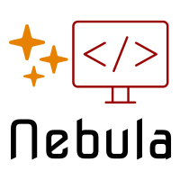

# Neb-Template <!-- omit in toc -->
<!-- markdownlint-disable MD033 -->
<!-- LOGO -->
<p align="center">
  <a href="https://github.com/StarForger">
    
  </a>

  <h3 align="center">Nebula Template</h3>

  <p align="center">
    A comprehensive template for initialising projects.
    <br />
    <a href="./doc">« Documentation »</a>
    <br />
    <br />
    <strong>Simple · Reusable · Documented</strong>
  </p>
  <br />
</p>

<!-- TODO change template name, url, logo, description -->

<!-- PROJECT SHIELDS -->
<!-- https://www.markdownguide.org/basic-syntax/#reference-style-links -->
[![Issues][issues-shield]][issues-url]
[![MIT License][license-shield]][license-url]

<!-- TABLE OF CONTENTS -->
## Contents <!-- omit in toc -->

- [About](#about)
  - [Built With](#built-with)
- [Getting Started](#getting-started)
  - [Requirements](#requirements)
  - [Installation](#installation)
- [Usage](#usage)
  - [Structure](#structure)
- [Roadmap](#roadmap)
- [License](#license)
- [Useful Links](#useful-links)

<!-- ABOUT -->
## About

[![Product Screen Shot][product-screenshot]][product-url]

I've made these files so many times that I finally had to make this template. With it I know I have everything I need and everthing I create will come from the same starting point.

<!-- TODO update about -->

### Built With

Some tools I almost always use:

- [Git](https://git-scm.com/docs/git#_git_commands)
- [Docker](https://docs.docker.com/reference/)
- [npm](https://docs.npmjs.com/cli/v7/commands)
- [bash](https://www.gnu.org/software/bash/manual/bash.html)
- [aws-cli](https://awscli.amazonaws.com/v2/documentation/api/latest/index.html)

<!-- TODO add more tools -->

<!-- GETTING STARTED -->
## Getting Started

To get a local copy up and running follow these steps:

### Requirements

Requirements and dependencies go here.

<!-- TODO Add requirements -->

### Installation

npm installs, script executions and downloads.

<!-- TODO Add installation instructions -->

<!-- USAGE EXAMPLES -->
## Usage

Use this space to show useful examples of how a project can be used. Additional screenshots, code examples and demos work well in this space. You may also link to more resources.

_For more examples, please refer to the [Documentation](./doc)_

### Structure

Generate a folder structure using the [tree](https://linux.die.net/man/1/tree) command

The command is also available on Windows, to run on GitBash you can do:

```bash
cmd //c tree
```

```text
neb-template
  |--bin
  |--doc   
  |----img 
  |--script
  |--src   
  |--test 
```

<!-- TODO update structure as needed -->

<!-- ROADMAP -->
## Roadmap

A list of upcoming changes, improvements and additions can be found at `TODO`.

There are also issues and features listed in the [issues][issues-url] page.

<!-- LICENSE -->
## License

Distributed under the MIT License. See `LICENSE` for more information.

<!-- Links -->
## Useful Links

- [placeholders](https://placeholder.com/)
- [ascii](https://theasciicode.com.ar/)
- [json pretty print](https://jsonformatter.org/json-pretty-print)
- [regex](https://regex101.com/)
- [awesome list](https://github.com/sindresorhus/awesome)
- [STUPID or SOLID](https://arbistech.com/stupid-or-solid-which-one-is-your-code/)
- [principles](https://dzone.com/articles/10-coding-principles-every-programmer-should-learn)

<!-- TODO update useful links -->

<!-- MARKDOWN LINKS & IMAGES -->
<!-- https://www.markdownguide.org/basic-syntax/#reference-style-links -->
[issues-shield]: https://img.shields.io/github/issues/StarForger/neb-template.svg?style=for-the-badge
[issues-url]: https://github.com/StarForger/neb-template/issues
[license-shield]: https://img.shields.io/github/license/StarForger/neb-template.svg?style=for-the-badge
[license-url]: ./LICENSE
[product-screenshot]: https://via.placeholder.com/460x80/B22222/FFFFFF?text=Neb%20Template
[product-url]: https://example.com
<!-- TODO update reference urls -->
